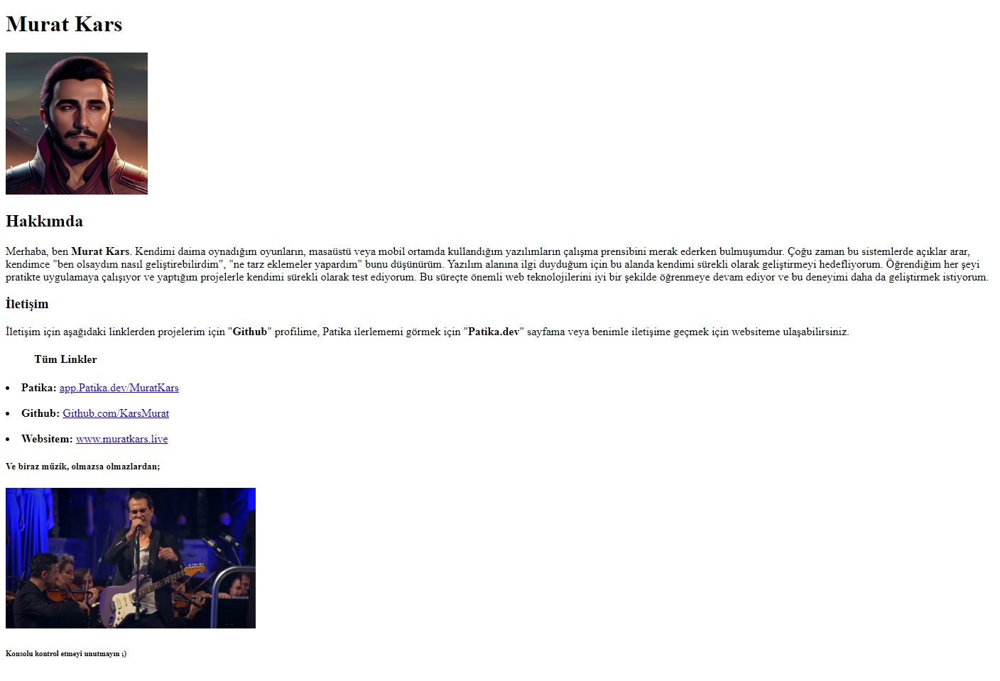

# Kodluyoruz - Patika HTML Ödev 1

[Kodluyoruz](https://www.kodluyoruz.org) Front-End Eğitimi kapsamında HTML Eğitimi Ödev 1 için oluşturduğum repo.

## Önizleme



## Kullanım

- ###### **_Repo'yu klonlayın._**

```bash
git clone https://github.com/KarsMurat/kodluyoruz-html-odev-1.git
```

- ###### **_"index.html" dosyasını doğrudan açın veya Visusal Studio Code ile aşağıdaki eklentiyi kurarak "index.html" dosyasını seçtikten sonra "Go Live" butonuna basın._**

Liver Server eklentisi: [https://marketplace.visualstudio.com/items?itemName=ritwickdey.LiveServer](https://marketplace.visualstudio.com/items?itemName=ritwickdey.LiveServer)

---

[www.patika.dev](https://www.patika.dev)
